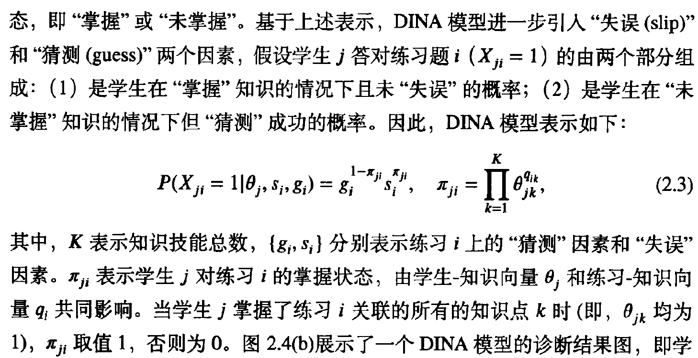
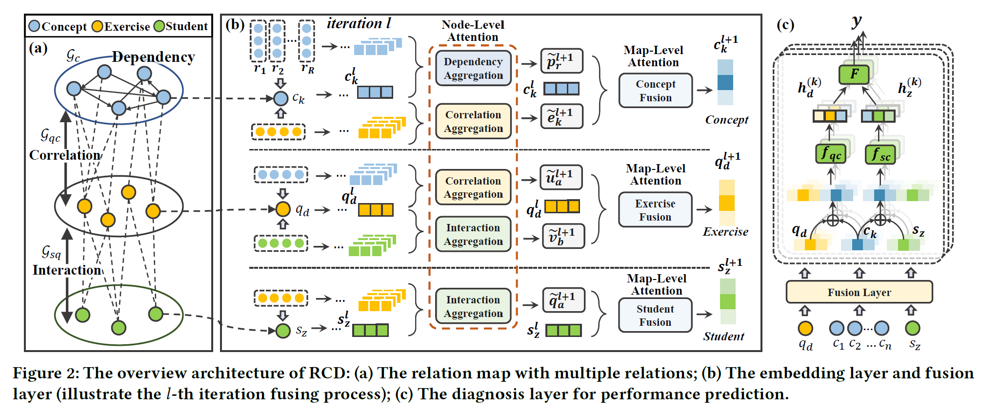
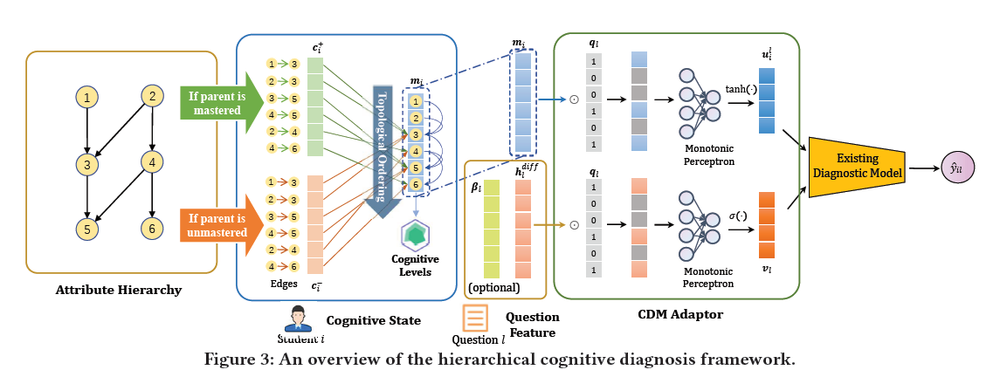

##  Cognitive Diagnosis  (CD)：

- Input:  the students' response logs of items (i.e., exercises/questions), the Q-matrix that denotes the correlation between items and knowledge concepts (skills). 
- The output is the diagnosed student knowledge states, such as students' abilities and students' proficiencies on each knowledge concepts.

### Different from KT: 

CD：假设学生的知识状态在一定时间内固定不变，通过对某一时刻测验成绩对学生学习状态进行评估。

KT： 通过历史学习数据，跟踪学生知识水平变化情况

### 1. Traditional  CDM:

通过学生特征（$\theta$）和练习特征（$\beta$）建模学生回答结果

#### 1.1 IRT（项目反映理论）: 、

学生j答对练习题i 的概率如下：

  $\theta_j$ : 学生j的能力值 

  ${a_i, b_i, C_i}$, 练习题区分度、难度和猜测度

- 区分度是指考试题目对考生心理特征的区分能力。区分度高的试题能将不同水平的考生区分开来，水平高的考生得高分，水平低的考生得低分。

  缺点： 仅反映宏观层次能力水平（$\theta_j$ 可视为学生综合能力 ）

​				例如学生得分相同，但知识能力不同

#### 1.2 DINA (确定性技能诊断模型)

- 引入Q矩阵（练习-知识矩阵）, 通常需要专家标注

- 学生j由一个二元离散向量表示，维度=知识点数目，每一维表示学生在具体知识点的掌握情况（1表示掌握，0则未掌握）$\theta_j$ 

优点： 将单维认知能力，扩展到多维知识掌握状态, 更强的可解释性

### 2. Current Work

#### 2.1 NeuralCD

优点 ： traditional model depended on manually designed functions， approximate interactions between students and exercises 

- student factors 
  - $h^s$, from trained matrix A
- exercise factors
  - $Q_e$, from pre-given Q-matrix 
  - $h_{diff}$，问题困难度， from trained matrix B
  - $h_{disc}$， 问题区分度,   from trained matrix D 
- interaction factors

Monotonicity Assumption: The probability of correct response to the exercise is monotonically increasing at any dimension of the student's knowledge proficiency.

method : restrict all weights to be positive, thus $\frac{\partial y}{\partial{h_i^s}}$ is positive 

#### 2.2 RCD

idea : jointly learn the relation-aware
representations of students, exercises and concepts based on the heterogeneous relation map,

- symbols

$\mathcal{C}$, set of concepts

$\mathcal{Q}$, set of exercises

$S$, set of skills

- concept-dependency map
  - $\mathcal{G_{c}}(\mathcal{C}, \mathcal{R}_c)$
  - labeled by experts, prerequisite and similarity
- exercise-concept correlation map
  - $\mathcal{G_{qc}}(\mathcal{Q} \cup\mathcal{C}, \mathcal{R}_{qc})$
  - $r_{ij}=1$ , exercise  $q_i$ include concept $c_j$
- student-exercise interaction map
  - $\mathcal{G_{sq}}(\mathcal{S} \cup\mathcal{Q}, \mathcal{R}_{sq})$
  - $r_{ij}=1$ , student $s_i$ has chosen exercise $q_j$ and answered it

RCD model:

- embedding layer
- fusion layer
  - knowledge concept fusion
- diagnosis layer

experiment details:

- dataset: junyi、assist09

- concept map 

#### 2.3 HierCDF

##### Baisc concepts: 

- S: students

- E: question

- C: attributes

- R:{(s, e, y)} set of response logs

- Q: Q-matrix

#####  Attributes hierarchy

G = (V, E), directed acyclic graph(DAG)

V： attribute node

E: a->b, a is the basis of the learning of b

##### Model

- cognitive state module
  - $m_{ik}$, student i' s cognitive level on attribute k
  - $c^{+}_{u,k|j}$, student i 's cognitive level on attribute k when she has master j 
  - $c^{-}_{u,k|j}$, student i 's cognitive level on attribute k when she has not master j 
- question feature module
- CDM adaptor 
